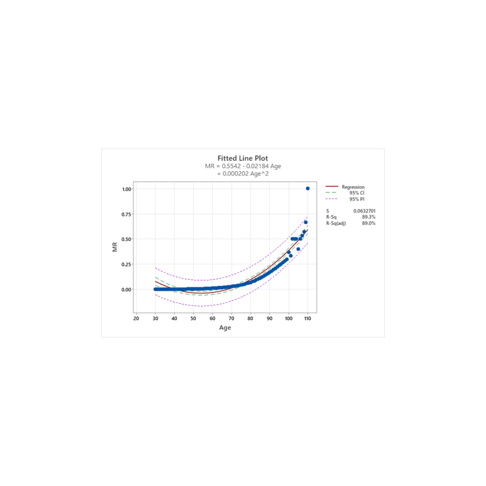
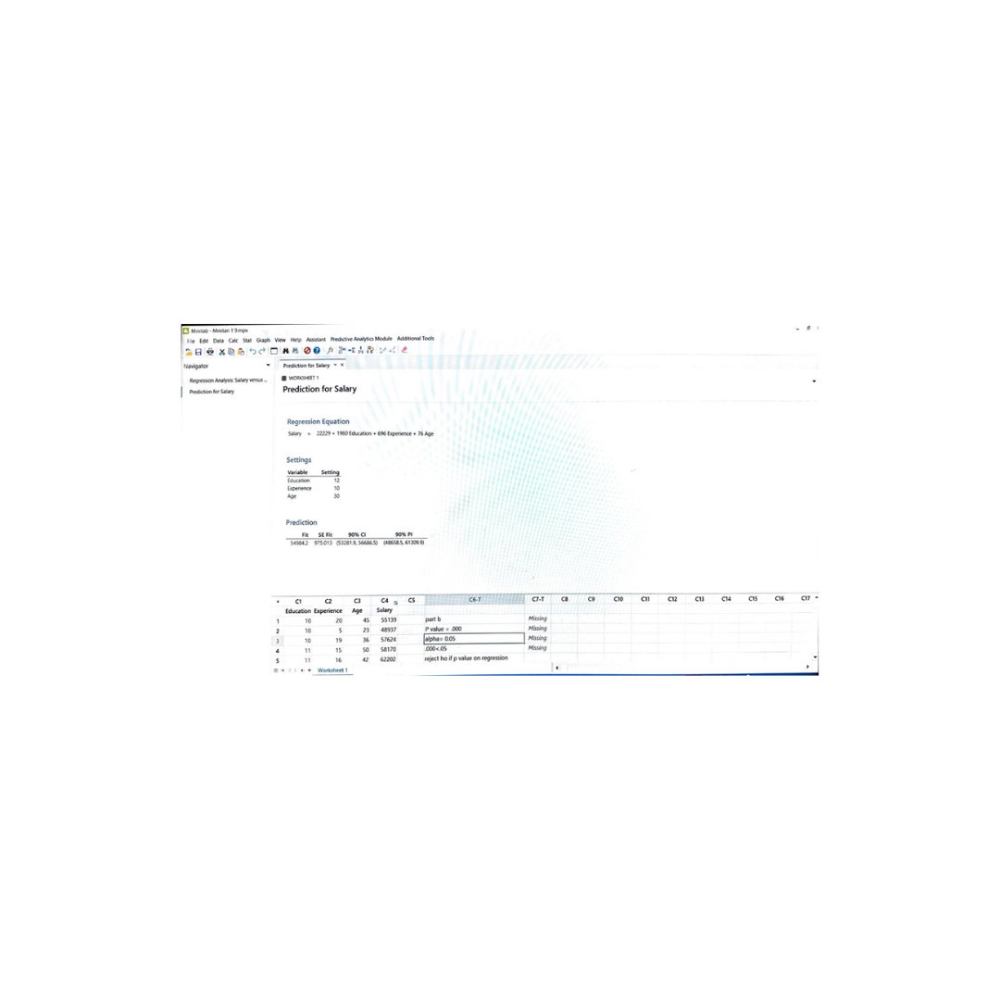

# Analyzing Salary, Construction Hours, and Mortality Rate Using Regression

This project focuses on regression analysis to understand various factors influencing salary, construction hours, and mortality rates.

## Objectives

- Estimate the relationship between education, experience, age, and salary.
- Understand the relationship between floor completion and construction hours, considering a fire's impact.
- Analyze mortality rates based on age using a quadratic regression function.

## Technologies Used

- **Statistical Software**: Minitab
- **Datasets**: Provided in the assignment (salaries_data, construction_hours_data, mortality_rate_data).

## Steps to Reproduce

1. **Set up your environment**:
   - Install Minitab or any preferred statistical software.
   
2. ** datasets **.
   Consider the following data set.
Row	Education	Experience	Age	Salary
1	10	20	45	55139
2	10	5	23	48937
3	10	19	36	57624
4	11	   15	50	58170
5	11	16	42	62202
6	11	8	30	51646
7	11	4	21	52563
8	12	10	34	49434
9	12	8	27	55153
10	12	18	38	63882
11	13	6	25	46067
12	13	10	46	60886
13	14	10	38	57190
14	14	2	22	52094
15	15	8	32	60620
16	16	5	49	59843
17	16	4	28	57288
18	17	7	33	67151
19	18	3	27	61313
20	19	3	32	64175

   
4. **Run the statistical analysis**:
   - Use regression techniques to analyze the datasets.
   - Calculate confidence intervals for various predictions.
   - Plot graphs as required to understand relationships and trends.

## Results
graph showing 95% prediction interval bands
 
 
 
 

- Developed regression equations to understand the relationships in different datasets.
- Computed confidence intervals for predictions to understand the range of possible outcomes.
- Analyzed factors like the market value of an MBA degree, the impact of a fire on construction hours, and the relationship between age and mortality rate.

## Conclusion

The regression analysis provided in-depth insights into various factors influencing salaries, construction hours, and mortality rates. The findings can be beneficial for human resources, construction management, and healthcare fields.
